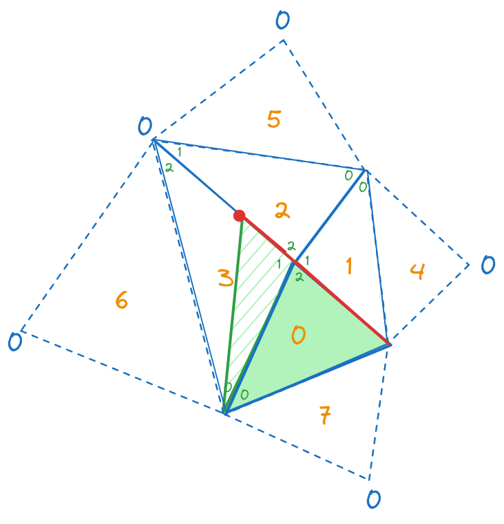

# Maillages et Géométrie Algorithmique

Ce projet a été réalisé dans le cadre de l'unité d'enseignement **Maillages et Géométrie Algorithmique** dans le cadre du M2 - ID3D à l'Université Claude Bernard Lyon 1.

# Structure du projet

```
├── data              
|   ├── obj     # Les fichiers .obj sont sauvegardés ici.      
|   |   └──queen.obj    # Fichier de sortie.
|   ├── off     # Fichier .off.
|   |   └──queen.off        # Fichier d'entrer.
|   ├── shaders         # Shaders utilisés pour le rendu avec GKit.
|   └── gradient.png    # Texture utilisée pour la diffusion de chaleur. 
├── src # Code 
|   ├── Include     # Fichiers .h.  
|   |   ├── ... 
|   |   ├── Geometry.h      # Définitions de plusieurs objets : Vertex, Face, etc...
|   |   ├── pch.h           # Headers précompilés.
|   |   ├── Timer.h         # Classe Timer utilisé pour mesurer les performances. 
|   |   ├── TMesh.h         # Classe du maillage triangulaire. 
|   |   ├── Utils.h         # Utilitaires
|   |   ├── Viewer.h        # Visualiseur utilisant GKit (App.h) ainsi que ImGui pour l'interface graphique. 
|   |   └── Window.h        # Utilitaire GKit pour la gestion de la fenêtre. 
|   ├── Source      # Fichiers .cpp.
|   |   └── ...
|   ├── CMakeLists.txt   # Configurartion CMake.   
|   └── main.cpp    
├── vendor  # 3th party libraries. 
|   └── ... 
├── .gitignore      # Fichier .gitignore.
├── CMakeLists.txt  # Configuration CMake.
└── README.md       # Fichier README du projet (contient le rapport des tps).
```

# Prérequis

Ce projet a uniquement été compilé/exécuté sous Linux.

### Gkit2light

La librairie Gkit2light est utilisée pour visualiser le maillage. 

Installer les packages suivants : 
```
sudo apt install libsdl2-dev libsdl2-image-dev libglew-dev premake4
```

# Compilation

- Configuration/Build

```
cd /path/to/gam && cmake -B build -DCMAKE_BUILD_TYPE=Release && cmake --build build/ -t gam -j 16 
```

- Exécution

```
./build/gam 
```

# Fonctionnalités de l'application

{  style="display: block; margin: 0 auto" }

L'application comporte trois fenêtres dockables :
- *Statistics* : Affichage des performances de l'application ainsi que des informations sur la géométrie comme le nombre de sommets / faces.   
- *Control Panel* : Panneau de contrôle de l'application. L'utilisateur peut activer/désactiver différents paramètres comme l'affichage des sommets/arêtes/faces, charger un fichier .off (*Laplacian Demo*) ou un nuage de point via un fichier .txt (*Delaunay Demo*). Il peut aussi modifier la couleur couleur de différents éléments (maillage, arêtes, sommets, etc...). 
- *Viewport* : Fenêtre d'affichage de l'application. L'utilisateur peut interagir avec l'objet visualisé (rotation, translation, zoom...). 

##### Présentation Détaillées : 

{  style="display: block; margin: 0 auto" }

- `a1` : Image par secondes.
- `a2` : Temps CPU. 
- `a3` : Temps GPU.
- `a4` : Frame rate.
-- 
- `b1` : Nombre de sommets. 
- `b2` : Nombre de triangles.
--
- `c1` : Basculer sur la démo du TP1 (Laplacien). 
- `c2` : Basculer sur la démo du TP2 (Delaunay). 
--
- *Laplacian Demo* 
    - `d1` : Charger un fichier .off présent dans `data/off/_.off`.
    - `d2` : [`n`] --> Afficher/Cacher les normales aux faces/sommets.
    - `d3` : [`m`] --> Coloration du maillage par rapport aux normales aux sommets.
    - `d4` : [`s`] --> Basculer du flat shading au smooth shading. 
    - `d5` : [`c`] --> Afficher/Cacher la courbure.
    - `d6` : [`h`] --> Lancer la simulation de la diffusion de chaleur.

  
 
- *Delaunay Demo*
    - [`LCTRL`] --> Ajouter un point au maillage (projection de la position de la sourie en 3D sur le plan Z=0).
    - `b3` : Temps triangulation de Delaunay (Insertion du nuage de points).
    - `f1` : Centrer la caméra sur l'objet. Calcule la boîte englobante de l'objet pour qu'il soit entièrement visible par la caméra. 
    - `f2` : [`i`] --> Afficher/Cacher les faces infinies.  
    - `f3` : Changer la valeur en z du point à l'infinie.  
    - `f4` : Nom de fichier contenant les coordonnées des points que l'on souhaite insérer.    
    - `f5` : Applique une homotéthie sur l'axe X des points en entrées.    
    - `f6` : Applique une homotéthie sur l'axe Y des points en entrées.    
    - `f7` : Pourcentage du nuage de points que l'on souhaite charger (0% insérera uniquement les trois premier points pour former la première face).   
    - `f8` : Mélange (si coché) le jeu de donnée en entrée (les points ne seront pas inséré dans l'ordre définit dans le fichier).   
    - `f9` : Charger le maillage / Lancer l'insertion/la triangulation des points.   
    - `f10` : Définir le nombre de points insérés à chaque clique sur `Next Insertion`.   
    - `f11` : Insérer le/les points suivants (Disponible si des points du nuage de points n'ont pas encore été insérés).

# Rapport

## Maillage triangulaire

Un maillage triangulaire (`TMesh`) peut se définir comme un ensemble de faces et de sommets.

Chaque sommet (`Vertex`) stocke sa position (`x, Y et Z`) ainsi que l'indice d'une de ses faces voisines (`i_face`).

Chaque face stocke l'indice de ces trois sommets (`Vertices`), ainsi que l'indice de ses trois faces voisines (`Neighbors`).

La méthode `load_off` de la classe `TMesh` permet de charger un fichier .off en connectant les faces entre elles.

Pour visualiser le maillage, la méthode `save_obj` permet de sauvegarder sa géométrie comme la position de ses sommets, leurs valeurs (en tant que coordonnées de texture), leurs normales ainsi que la topologie du maillage.

{  style="display: block; margin: 0 auto" }

## Diffusion de la chaleur

Pour la diffusion de la chaleur, on utilise la formule suivante :

$$
\delta t \times \Delta u_i[t]= u_i[t+\delta t] + u_i[t]
$$

avec :

- $\delta t$, le pas de temps.
- $u_i[t]$, la valeur, au temps $t$, du sommet $i$.
- $u_i[t+\delta t]$, la valeur, au temps $t+\delta t$, du sommet $i$.
- $\Delta u_i[t]$, la valeur du laplacien, au temps $t$, du sommet $i$.

Grace à cette formule, on peut calculer u_i[t+\delta t] pour chaque sommet du maillage, à chaque pas de temps $\delta t$.

Avec le sommet d'indice 0 à *100* et un pas de temps de *1e-5* , on obtient ceci :
{  style="display: block; margin: 0 auto" }

## Normales

Pour le calcul des normales, on utilise la formule de cotangente du Laplacien qui, pour chaque sommet $i$, nous donne la courbure moyenne $H$ multipliée par la normale $n_i$ :

$$
-2Hn_i=\frac{1}{2A_i}\sum_j{(\text{cot}\alpha_{ij}+\text{cot}\beta_{ij})(u_j-u_i)}
$$

La courbure peut être positive ou négative selon si la forme est concave ou convexe. Si l'on prend la valeur calculée précédemment comme étant la normale, certaines seront inversées :

{  style="display: block; margin: 0 auto" }

Pour déterminer si une normale doit être inversée, on effectue un test de direction avec l'une des normales des faces voisines au sommet. Si le produit scalaire entre la normale de la face voisine et le vecteur calculé précédemment est négatif, on l'inverse. On obtient ceci :
{  style="display: block; margin: 0 auto" }

Couleur du maillage en fonction des normales aux sommets :

{  style="display: block; margin: 0 auto" }

L'application permet d'afficher les normales aux sommets ainsi que les normales aux faces en appuyant sur la touche `n`:
{  style="display: block; margin: 0 auto" }

## Courbure

Pour calculer la courbure, on prend la norme du vecteur calculé en utilisant le laplacien et on normalise cette valeur entre 0 et 1 (pour pouvoir l'utiliser par la suite comme coordonnées de texture) en la divisant par le maximum. On obtient ceci :
{  style="display: block; margin: 0 auto" }

# Triangulation de Delaunay

{  style="display: block; margin: 0 auto" }

## Fonctions de couture

Pour effectuer une insertion de point dans le maillage, on a besoin de créer trois méthodes de couture :

- **triangle_split** : coupe un triangle en trois. Cette méthode est utilisée lorsque le point inséré se trouve à l'intérieur d'une des faces d'un maillage.
- **edge_split** : coupe en deux les faces adjacentes à l'arête sur laquelle le point est inséré.
- **flip_edge** : Utilisée lorsque un point est inséré hors de l'enveloppe convexe et dans l'algorithme de Lawson pour la triangulation de Delaunay.

### Triangle Split

##### Schéma :
{  style="display: block; margin: 0 auto" }

##### Code :

```c++
// Insertion du point p à l'intérieur de la face d'indice i_face.
void triangle_split(const Point& p, IndexType i_face) 
// p : Le point que l'on veut insérer.
// i_face : L'indice de la face contenant p.
{  
    Face face = m_faces[i_face]; // Récupération d'une copie de la face d'indice i_face.
    IndexType i_vertex = vertex_count(); // Récupération de l'indice du point que l'on veut insérer.

    m_vertices.emplace_back(p, i_face); // Ajout du point dans le maillage.

    // Récupération de l'indice des deux nouvelles faces que l'on veut ajouter.
    IndexType i_face2 = face_count(); 
    IndexType i_face3 = face_count() + 1;

    // Mise à jour de la topologie de la face i_face.
    m_faces[i_face][2] = i_vertex;
    m_faces[i_face](0) = i_face2;
    m_faces[i_face](1) = i_face3;

    // Ajout des deux nouvelles faces.
    m_faces.emplace_back(face[1], face[2], i_vertex, i_face3, i_face, face(0));
    m_faces.emplace_back(face[2], face[0], i_vertex, i_face, i_face2, face(1));

    // Mise à jour l'indice de la face adjacente du point qui n'appartient plus à i_face.
    m_vertices[face[2]].FaceIndex = i_face2;

    // Mise à jour des faces voisines.
    m_faces[face(0)].change_neighbor(i_face, i_face2);
    m_faces[face(1)].change_neighbor(i_face, i_face3);
}
```

##### Résultat :

{  style="display: block; margin: 0 auto" }
**Note** : Le point qui n'est pas relié au maillage est le point à l'infinie.


### Edge Split

##### Schéma :
{  style="display: block; margin: 0 auto" }

##### Code : 

```c++
// Insertion du point p sur une arête. faisant partie de la face i_face0 (l'arête joint deux triangles, face0 est l'une des deux), opposée à l'indice local d'indice i_edge0.
void TMesh::edge_split(const Point &p, IndexType i_face0, IndexType i_edge0)
// p : point que l'on veut insérer. 
// i_face0 : indice d'une des deux faces contenant l'arête. 
// i_edge0 : indice local du sommet opposé à l'arête dans la face i_face0. 
{
    IndexType i_vertex = vertex_count(); // Récupération de l'indice du point que l'on veut insérer.

    m_vertices.emplace_back(p, i_face0); // Ajout du point dans le maillage. 

    // Récupération des indices des deux nouvelles faces qui vont être créées.
    IndexType i_face2 = face_count();  
    IndexType i_face3 = face_count() + 1;

    
    IndexType i_face1 = m_faces[i_face0](i_edge0); // Récupération de la seconde face comportant l'arête. 
    IndexType i_edge1 = m_faces[i_face1].get_edge(i_face0); // Récupération de l'indice local du sommet opposée à l'arête dans la seconde face. 

    // Récupération d'une copie de chaque face (elles sont utilisées pour construire les nouvelles faces et mettre à jour les anciennes). 
    Face face0 = m_faces[i_face0];  
    Face face1 = m_faces[i_face1]; 

    // Mise à jour de la face 0.
    m_faces[i_face0].vertices(face0[i_edge0], face0[(i_edge0 + 1) % 3], i_vertex);
    m_faces[i_face0].neighbors(face0(i_edge0), i_face3, face0((i_edge0 + 2) % 3));

    // Mise à jour de la face 1.
    m_faces[i_face1].vertices(face1[i_edge1], i_vertex, face1[(i_edge1 + 2) % 3]);
    m_faces[i_face1].neighbors(face1(i_edge1), face1((i_edge1 + 1) % 3), i_face2);

    // Créatrion des deux nouvelles faces.
    m_faces.emplace_back(face1[i_edge1], face1[(i_edge1 + 1) % 3], i_vertex, i_face3, i_face1, face1((i_edge1 + 2) % 3));
    m_faces.emplace_back(face0[i_edge0], i_vertex, face0[(i_edge0 + 2) % 3], i_face2, face0((i_edge0 + 1) % 3), i_face0);

    // Un seul sommet à besoin d'être mis à jour. 
    m_vertices[face0[(i_edge0 + 2) % 3]].FaceIndex = i_face2;

    // Mise à jour des faces voisines. 
    m_faces[face0((i_edge0 + 1) % 3)].change_neighbor(i_face0, i_face3);
    m_faces[face1((i_edge1 + 2) % 3)].change_neighbor(i_face1, i_face2);
}
```

**Note** : Lors de la création des nouvelles faces et la mise à jour des faces déjà existantes, on s'assure que le sommet d'indice local zéro est le sommet opposé à la face. Cela permet par la suite que le découpage d'une face infinie garantisse que le sommet à l'infini (sommet d'indice zéro dans la liste des sommets du maillage) soit d'indice local zéro dans les deux nouvelles faces infinies. Cela nous facilitera la vie plus tard. 

##### Résultat :

{  style="display: block; margin: 0 auto" }

### Flip Edge

##### Schéma :
{  style="display: block; margin: 0 auto" }

##### Code : 

```c++
// Basculer une arête.
void TMesh::flip_edge(IndexType i_face0, IndexType i_edge0)
// i_face0 : indice d'une des deux faces contenant l'arête. 
// i_edge0 : indice local du sommet opposé à l'arête dans la face i_face0. 
{
    IndexType i_face1 = m_faces[i_face0](i_edge0); // Récupération de l'indice de la seconde face contenant l'arête. 
    IndexType i_edge1 = m_faces[i_face1].get_edge(i_face0); // Récupération de l'indice local du sommet opposé à l'arête. 

    // Récupération d'une copie de chaque face. 
    Face face0 = m_faces[i_face0];
    Face face1 = m_faces[i_face1];        

    // Mise à jour de la face 0.
    m_faces[i_face0][0] = face0[(i_edge0 + 1) % 3];
    m_faces[i_face0][1] = face1[i_edge1];
    m_faces[i_face0][2] = face0[i_edge0];
    m_faces[i_face0](0) = i_face1;
    m_faces[i_face0](1) = face0((i_edge0 + 2) % 3);
    m_faces[i_face0](2) = face1((i_edge1 + 1) % 3);

    // Mise à jour de la face 1.
    m_faces[i_face1][0] = face1[(i_edge1 + 1) % 3];
    m_faces[i_face1][1] = face0[i_edge0];
    m_faces[i_face1][2] = face1[i_edge1];
    m_faces[i_face1](0) = i_face0;
    m_faces[i_face1](1) = face1((i_edge1 + 2) % 3);
    m_faces[i_face1](2) = face0((i_edge0 + 1) % 3);

    // Mise à jour des deux sommets qui ont changés de face. 
    m_vertices[face0[(i_edge0 + 1) % 3]].FaceIndex = i_face0;
    m_vertices[face1[(i_edge1 + 1) % 3]].FaceIndex = i_face1;

    // Mise à jour des voisins. 
    m_faces[face0((i_edge0 + 1) % 3)].change_neighbor(i_face0, i_face1);
    m_faces[face1((i_edge1 + 1) % 3)].change_neighbor(i_face1, i_face0);
}
```
**Note** : On définit la nouvelle topologie de chaque face en partant des sommets opposés à l'arête. Cela nous assure que les nouvelles faces seront orientées dans le sens anti-horaire (trigonométrique) peu importe la configuration initiale. Comme pour la méthode `edge_split`, on s'assure que les sommets opposés à l'arête qui a été flipée soient les sommets d'indice local zéro dans les nouvelles faces. Ce sera utile pour faciliter l'insertion hors de l'enveloppe convexe.  

## Insertion naïve

Dans un premier temps, une insertion naïve des points a été implémentée (on insère les points sans s'assurer de la qualité des triangles résultants). 

Avant de gérer l'insertion des points dans le maillage, on construit la première face / le premier triangle ainsi que les trois faces infinies voisines : 

##### Code : 

```c++
// Ajout du point à l'infinie (indice 0)
m_vertices.emplace_back(0., 0., -1., 1); 

// Ajout des trois premiers sommets. 
m_vertices.emplace_back(points[0].x, points[0].y, 0, 0);
m_vertices.emplace_back(points[1].x, points[1].y, 0, 0);
m_vertices.emplace_back(points[2].x, points[2].y, 0, 0);

// Construction de la première face.
// Les trois premier entiers sont les indices des sommets et les trois suivants sont les indices des faces voisines.
m_faces.emplace_back(1, 2, 3, 2, 3, 1);

// On vérifie que la face construite soit bien orienté dans le sens trigonométrique. 
check_orientation(m_faces[0]); 

// Construction des faces infinies. 
Face face0 = m_faces[0];
m_faces.emplace_back(0, face0[1], face0[0], 0, face0(1), face0(0));
m_faces.emplace_back(0, face0[2], face0[1], 0, face0(2), face0(1));
m_faces.emplace_back(0, face0[0], face0[2], 0, face0(0), face0(2));
```

On insère ensuite les points suivants en utilisant la méthode `insert_vertex(p)` :

##### Code : 

```c++
// Insertion naïve d'un point dans le maillage.
void TMesh::insert_vertex(const Point &p)
// p : Point à insérer.
{
    // locate_triangle (méthode de localisation de triangle présentée précédemment) retourne la paire suivante : [ found, [ i_face, i_edge ] ]
    // found : renvoie vrai si une face / arête du maillage contient le point, faux sinon.  
    // i_face : renvoie l'indice de la face qui contient le point ou bien l'indice de la face infinie sur laquelle l'insertion hors de l'enveloppe convexe commence.
    // i_edge : Si le point est sur une arête, correspond à l'indice local du sommet opposé à cette arête dans la face d'indice i_face. Dans le cas où il n'y a pas d'intersection avec une arête, cette valeur est mise à -1.   
    auto loc = locate_triangle(p); 
    bool found = loc.first;
    int i_face = loc.second.first;
    int i_edge = loc.second.second;

    if (found) // Une face (non infinie) du maillage contient le point. 
    {
        if (i_edge >= 0) // insertion du point sur une arête.
        {
            edge_split(p, i_face, i_edge);
        }
        else // insertion du point à l'intérieur d'une face.
        {
            triangle_split(p, i_face);
        }
    }
    else // Le point se trouve en dehors de l'enveloppe convexe. 
    {
        insert_outside(p, i_face);
    }
}
```

Les méthodes de couture présentées ci-dessus vont nous permettre d'insérer les points dans le maillage. Deux choses supplémentaires sont à mettre en place :
- Localiser le triangle / l'arête contenant le point que l'on souhaite insérer. 
- Gérer l'insertion en dehors de l'enveloppe convexe.

### Localisation du triangle contenant le point.

Une première méthode "bourrine" consiste simplement à parcourir tous les triangles du maillage en faisant des tests d'orientation et en s'arrêtant une fois la face trouvée. Mais on peut faire beaucoup mieux. Plutôt que de parcourir toutes les faces du maillage, on part de la face d'indice 0 et on fait des tests d'orientation sur les triangles formés par les arêtes de cette même face et le point inséré. L'idée est d'effectuer un à maximum deux tests d'orientation par triangle (sauf pour la première face où trois tests peuvent être effectués). 

Si le triangle construit par l'une des arêtes de la face et du point à inséré est orienté dans le sens trigonométrique, alors le point est nécessairement en dehors de la face. Sinon, on teste l'arête suivante. 

Si toutes les arêtes de la face ont été testées et qu'aucun triangle construit par ces arêtes n'est orienté dans le sens trigonométrique, alors le point se trouve à l'intérieur de la face. 

Un cas particulier concernant la présence du point à insérer sur une des arêtes de la face est à considérer. Le test d'orientation est un simple calcul de déterminant de la matrice suivante :

{  style="display: block; margin: 0 auto" }

avec $p$, $q$ et $r$ les sommets du triangle. 

Ce test d'orientation retourne 1 si le triangle est orienté dans le sens trigonométrique, -1 si orienté dans le sens horaire et 0 si les points sont colinéaires. Dans nos tests d'orientation lors de la recherche de la face qui contient le point à insérer, il peut arriver que le point soit aligné avec l'une des arêtes de la face considérée sans pour autant être à l'intérieur de cette même face. 

##### Schéma (alignement du point avec une arête):
{  style="display: block; margin: 0 auto" }

Sur le schéma ci-dessus, le point est aligné avec l'arête de la face mais ne se situe pas à l'intérieur. On doit donc vérifier l'arête suivante pour déterminer si oui ou non le point est à l'intérieur de la face. 

Voici une illustration de l'algorithme pour la première face :

##### Schéma (déroulement de l'algorithme sur la première face):
{  style="display: block; margin: 0 auto" }


Le processus est répété jusqu'à ce que le triangle contenant le point soit trouvé, ou bien que le triangle courrant soit une face infinie. Sur l'exemple ci-dessus, l'algorithme s'arrête sur la face infinie d'indice 9, ce qui activera une insertion en dehors de l'enveloppe convexe.

### Insertion d'un point en dehors de l'enveloppe convexe.

Lorsque le point se trouve en dehors de l'enveloppe convexe, il faut s'assurer de créer tous les triangles nécessaires pour garder une triangulation convexe. 

La première opération effectuée est un `triangle_split` qui nous place dans la configuration `3.` du schéma ci-dessus :

##### Schéma :
{  style="display: block; margin: 0 auto" }

Ensuite, il faut itérer sur les arêtes externes à droite et à gauche de l'arête de départ. Tant qu'une arête est visible par le point (test d'orientation), on applique un `flip_edge`. 

Pour se faciliter la vie, on définit les faces infinies de sorte que le point à l'infini (point opposé aux arêtes de l'enveloppe convexe) soit le sommet d'indice local zéro. La méthode `slide_triangle` permet de s'assurer que les triangles infinis sont bien définis.  

##### Code : 

```c++
void TMesh::insert_outside(const Point &p, IndexType i_face)
{
    auto nf = neighboring_faces_of_vertex(0); // Récupération des faces voisines du point à l'infinie. 

    int itf = std::find(nf.begin(), nf.end(), i_face) - nf.begin(); // On récupère l'idice de la face de départ dans les faces voisines du point à l'infinie.

    triangle_split(p, i_face); // Première opération, insert le point dans le maillage.

    slide_triangle(face_count() - 1); // On s'assure que la dernière face ajoutée (face à l'infinie créée par le triangle_split) est correctement définit. 

    // Itération sur les arêtes à droite.
    int i = (itf - 1 + nf.size()) % nf.size();
    Point a = Vertex::as_point(m_vertices[m_faces[nf[i]][1]]);
    Point b = Vertex::as_point(m_vertices[m_faces[nf[i]][2]]);
    while (orientation(a, b, p) == 1)
    {
        flip_edge(nf[i], 1);
        i = (i - 1 + nf.size()) % nf.size();
        a = Vertex::as_point(m_vertices[m_faces[nf[i]][1]]);
        b = Vertex::as_point(m_vertices[m_faces[nf[i]][2]]);
    }

    // Itération sur les arêtes à gauche.
    i = (itf + 1) % nf.size();
    a = Vertex::as_point(m_vertices[m_faces[nf[i]][1]]);
    b = Vertex::as_point(m_vertices[m_faces[nf[i]][2]]);
    while (orientation(a, b, p) == 1)
    {
        flip_edge(nf[i], 2);
        i = (i + 1) % nf.size();
        a = Vertex::as_point(m_vertices[m_faces[nf[i]][1]]);
        b = Vertex::as_point(m_vertices[m_faces[nf[i]][2]]);
    }
}
```

##### Résultat : 

{  style="display: block; margin: 0 auto" }

## Triangulation de Delaunay : Méthode iterative (Lawson)

Pour obtenir une triangulation comportant des triangles de bonnes qualités, on passe par une triangulation de Delaunay avec l'algorithme de Lawson itératif. 

L'idée est la suivante : 
- Un point est inséré : utilisation des méthodes de couture (éventuellement hors de l'enveloppe convexe).
- Les arêtes opposées au point inséré sont mises dans une pile. 
- Itération sur ces arêtes, predicate `in_circle` (calcul de déterminant) pour checker si l'arête est localement de Delaunay.
- Si l'arête appartient à une face infinie, on l'enlève de la pile sans appliquer de flip. 
- On s'arrête lorsque la pile est vide. 


{  style="display: block; margin: 0 auto" }

##### Code : 

```c++
// Triangulation de Delaunay à l'insertion d'un point. Cette méthode est appelé après l'insertion naïve du point.
void TMesh::lawson(IndexType i_vertex)
// i_vertex : indice du point inséré.
{
    auto faces = neighboring_faces_of_vertex(i_vertex); // Récupération des faces voisines.  

    std::stack<IndexType> to_check; // Déclaration de la pile. 

    // Ajout des indices de face dans la pile. On aura simplement à récupérer l'indice local du point inséré pour trouver l'arête dans la face considérée. 
    for (auto i_face : faces)
        to_check.push(i_face);

    while (!to_check.empty()) 
    {
        // Récupération de la face courante. 
        IndexType i_face0 = to_check.top();
        to_check.pop();

        // Si face infinit, on passe à la prochaine arête. 
        if (is_infinite_face(i_face0))
            continue;

        // Récupération de l'indice local du point opposé à l'arête. 
        Face face0 = m_faces[i_face0];
        IndexType i_edge0 = local_index(i_vertex, i_face0);
        
        // Récupération de l'indice de la face voisine. 
        IndexType i_face1 = face0(i_edge0);

        // Si cette face est infinie, on passe à la prochaine arête. 
        if (is_infinite_face(i_face1))
            continue;

        // Test qui vérifie si le point opposé à l'arête dans la face voisine est à l'intérieur du cercle circonscrit au triangle de la face 0 (face récupérée depuis la pile). 
        Face face1 = m_faces[i_face1];
        IndexType i_edge1 = face1.get_edge(i_face0);

        Vertex p = m_vertices[face1[i_edge1]];
        Vertex a = m_vertices[face0[0]];
        Vertex b = m_vertices[face0[1]];
        Vertex c = m_vertices[face0[2]];
        if (in_circle(Vertex::as_point(p), Vertex::as_point(a), Vertex::as_point(b), Vertex::as_point(c)))
        {
            flip_edge(i_face0, i_edge0);

            // Ajout des deux nouvelles faces dans la pile (deux nouvelles arêtes à tester).
            to_check.push(i_face0);
            to_check.push(i_face1);
        }
    }
}
```

##### Schéma (triangluation de Delaunay lors de l'insertion d'un point):

{  style="display: block; margin: 0 auto" }

##### Resultats

##### Comparaison insertion naïve sans (à gauche) et avec (à droite) la triangulation de Delaunay : 

{  style="display: block; margin: 0 auto" }

##### Insertion itérative :

{ style="display: block; margin: 0 auto" }

##### Quelques statistiques :

| Fichier              | Nombre de points | Temps de triangulation de delaunay (moyenne sur dix tests en release) |
|----------------------|------------------|-----------------------------------------------------------|
| blue_noise.txt       | 4096             | ~11 ms 577 us                                             |
| noise_poisson.txt    | 6528             | ~20 ms 800 us                                             |
| alpes_poisson.txt    | 9505             | ~34 ms 640 us                                             |
| alpes_random_1.txt   | 10000            | ~34 ms 916 us                                             |
| noise_random_1.txt   | 10000            | ~37 ms 301 us                                             |
| noise_random_2.txt   | 20000            | ~76 ms 031 us                                             |
| alpes_random_2.txt   | 30000            | ~118 ms 024 us                                            |
