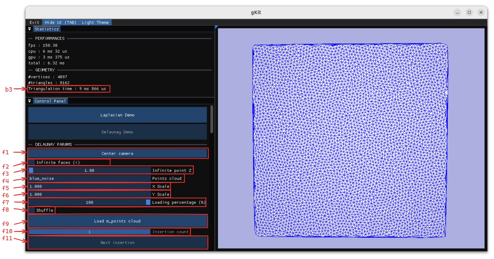

# Maillages et Géométrie Algorithmique

Ce projet a été réalisé dans le cadre de l'unité d'enseignement **Maillages et Géométrie Algorithmique** dans le cadre du M2 - ID3D à l'Université Claude Bernard Lyon 1.

# Structure du projet

```
├── data              
|   ├── obj     # Les fichiers .obj sont sauvegardés ici.      
|   |   └──queen.obj    # Fichier de sortie.
|   ├── off     # Fichier .off.
|   |   └──queen.off        # Fichier d'entrer.
|   ├── shaders         # Shaders utilisés pour le rendu avec GKit.
|   └── gradient.png    # Texture utilisée pour la diffusion de chaleur. 
├── src # Code 
|   ├── Include     # Fichiers .h.  
|   |   ├── ... 
|   |   ├── Geometry.h      # Définitions de plusieurs objets : Vertex, Face, etc...
|   |   ├── pch.h           # Headers précompilés.
|   |   ├── Timer.h         # Classe Timer utilisé pour mesurer les performances. 
|   |   ├── TMesh.h         # Classe du maillage triangulaire. 
|   |   ├── Utils.h         # Utilitaires
|   |   ├── Viewer.h        # Visualiseur utilisant GKit (App.h) ainsi que ImGui pour l'interface graphique. 
|   |   └── Window.h        # Utilitaire GKit pour la gestion de la fenêtre. 
|   ├── Source      # Fichiers .cpp.
|   |   └── ...
|   ├── CMakeLists.txt   # Configurartion CMake.   
|   └── main.cpp    
├── vendor  # 3th party libraries. 
|   └── ... 
├── .gitignore      # Fichier .gitignore.
├── CMakeLists.txt  # Configuration CMake.
└── README.md       # Fichier README du projet (contient le rapport des tps).
```

# Prérequis

Ce projet a uniquement été compilé/exécuté sous Linux.

### Gkit2light

La librairie Gkit2light est utilisée pour visualiser le maillage. 

Installer les packages suivants : 
```
sudo apt install libsdl2-dev libsdl2-image-dev libglew-dev premake4
```

# Compilation

- Configuration/Build

```
cd /path/to/gam && cmake -B build -DCMAKE_BUILD_TYPE=Release && cmake --build build/ -t gam -j 16 
```

- Exécution

```
./build/gam 
```

# Fonctionnalités de l'application


L'application comporte trois fenêtres dockables :
- *Statistics* : Affichage des performances de l'application ainsi que des informations sur la géométrie comme le nombre de sommets / faces.   
- *Control Panel* : Panneau de contrôle de l'application. L'utilisateur peut activer/désactiver différents paramètres comme l'affichage des sommets/arêtes/faces, charger un fichier .off (*Laplacian Demo*) ou un nuage de point via un fichier .txt (*Delaunay Demo*). Il peut aussi modifier la couleur couleur de différents éléments (maillage, arêtes, sommets, etc...). 
- *Viewport* : Fenêtre d'affichage de l'application. L'utilisateur peut intéragir avec l'objet visualisé (rotation, translation, zoom ...). 

##### Présentation Détaillées : 

 

- `a1` : Image par secondes.
- `a2` : Temps CPU. 
- `a3` : Temps GPU.
- `a4` : Frame rate.
-- 
- `b1` : Nombre de sommets. 
- `b2` : Nombre de triangles.
--
- `c1` : Basculer sur la démo du TP1 (Laplacien). 
- `c2` : Basculer sur la démo du TP2 (Delaunay). 
--
- *Laplacian Demo* 
    - `d1` : Charger un fichier .off présent dans `data/off/_.off`.
    - `d2` : [`n`] --> Afficher/Cacher les normales aux faces/sommets.
    - `d3` : [`m`] --> Coloration du maillage par rapport aux normales aux sommets.
    - `d4` : [`s`] --> Basculer du flat shading au smooth shading. 
    - `d5` : [`c`] --> Afficher/Cacher la courbure.
    - `d6` : [`h`] --> Lancer la simulation de la diffusion de chaleur.


 
- *Delaunay Demo*
    - [`LCTRL`] --> Ajouter un point au maillage (projection de la position de la sourie en 3D sur le plan Z=0).
    - `f1` : Temps triangulation de Delaunay (Insertion du nuage de points).
    - `g1` : Centrer la caméra sur l'objet. Calcule la boîte englobante de l'objet pour qu'il soit entièrement visible par la caméra. 
    - `g2` : Insérer le point suivant (Disponible si des points du nuage de points n'ont pas encore été insérés).
    - `g3` : [`i`] --> Afficher/Cacher les faces infinies.  
    - `g4` : Nom de fichier contenant les coordonnées des points que l'on souhaite insérer.    
    - `g5` : Pourcentage du nuage de points que l'on souhaite charger (0% insérera uniquement les trois premier points pour former la première face).   
    - `g6` : Mélange (si coché) le jeu de donnée en entrée (les points ne seront pas inséré dans l'ordre définit dans le fichier).   
    - `g7` : Charger le maillage / Lancer l'insertion/la triangulation des points.   

# Rapport

## Maillage triangulaire

Un maillage triangulaire (`TMesh`) peut se définir comme un ensemble de faces et de sommets.

Chaque sommet (`Vertex`) stocke sa position (`x, Y et Z`) ainsi que l'indice d'une de ses faces voisines (`i_face`).

Chaque face stocke l'indice de ces trois sommets (`Vertices`), ainsi que l'indice de ses trois faces voisines (`Neighbors`).

La méthode `load_off` de la classe `TMesh` permet de charger un fichier .off en connectant les faces entre elles.

Pour visualiser le maillage, la méthode `save_obj` permet de sauvegarder sa géométrie comme la position de ses sommets, leurs valeurs (en tant que coordonnées de texture), leurs normales ainsi que la topologie du maillage.


## Diffusion de la chaleur

Pour la diffusion de la chaleur, on utilise la formule suivante :

$$
\delta t \times \Delta u_i[t]= u_i[t+\delta t] + u_i[t]
$$

avec :

- $\delta t$, le pas de temps.
- $u_i[t]$, la valeur, au temps $t$, du sommet $i$.
- $u_i[t+\delta t]$, la valeur, au temps $t+\delta t$, du sommet $i$.
- $\Delta u_i[t]$, la valeur du laplacien, au temps $t$, du sommet $i$.

Grace à cette formule, on peut calculer u_i[t+\delta t] pour chaque sommet du maillage, à chaque pas de temps $\delta t$.

Avec le sommet d'indice 0 à *100* et un pas de temps de *1e-5* , on obtient ceci :


## Normales

Pour le calcul des normales, on utilise la formule de cotangente du Laplacien qui, pour chaque sommet $i$, nous donne la courbure moyenne $H$ multipliée par la normale $n_i$ :

$$
-2Hn_i=\frac{1}{2A_i}\sum_j{(\text{cot}\alpha_{ij}+\text{cot}\beta_{ij})(u_j-u_i)}
$$

La courbure peut être positive ou négative selon si la forme est concave ou convexe. Si l'on prend la valeur calculée précédemment comme étant la normale, certaines seront inversées :


Pour déterminer si une normale doit être inversée, on effectue un test de direction avec l'une des normales des faces voisines au sommet. Si le produit scalaire entre la normale de la face voisine et le vecteur calculé précédemment est négatif, on l'inverse. On obtient ceci :


Couleur du maillage en fonction des normales aux sommets :


L'application permet d'afficher les normales aux sommets ainsi que les normales aux faces en appuyant sur la touche `n`:


## Courbure

Pour calculer la courbure, on prend la norme du vecteur calculé en utilisant le laplacien et on normalise cette valeur entre 0 et 1 (pour pouvoir l'utiliser par la suite comme coordonnées de texture) en la divisant par le maximum. On obtient ceci :


# Triangulation de Delaunay

## Fonctions de couture

Pour effectuer une insertion de point dans le maillage, on a besoin de créer trois méthodes de couture :

- **triangle_split** : coupe un triangle en trois. Cette methode est utilisée lorsque le point inséré se trouve à l'intérieur d'une des faces d'une maillage.
- **edge_split** : coupe en deux les faces adjacentes à l'arête sur laquelle le point est inséré.
- **flip_edge** : Utilisée lorsque un point est inséré hors de l'enveloppe convexe et dans l'algorithme de Lawson pour la triangulation de Delaunay.

### Triangle Split


##### Code :

```c++
// Insertion du point p à l'intérieur de la face d'indice i_face.
void triangle_split(const Point& p, IndexType i_face) 
// p -> Le point que l'on veut insérer.
// i_face -> L'indice de la face contenant p.
{  
    auto face = m_faces[i_face]; // Récupération de la face d'indice i_face.
    int i_vertex = vertex_count(); // Récupération de l'indice du point que l'on veut insérer.

    m_vertices.emplace_back(p, i_face); // Ajout du point dans le maillage.

    // Récupération de l'indice des deux nouvelles faces que l'on veut ajouter.
    IndexType i_face2 = face_count(); 
    IndexType i_face3 = face_count() + 1;

    // Mise à jour de la topologie de la face i_face.
    m_faces[i_face][2] = i_vertex;
    m_faces[i_face](0) = i_face2;
    m_faces[i_face](1) = i_face3;

    // Ajout des deux nouvelles faces.
    m_faces.emplace_back(face[1], face[2], i_vertex, i_face3, i_face, face(0));
    m_faces.emplace_back(face[2], face[0], i_vertex, i_face, i_face2, face(1));

    // Mise à jour l'indice de la face adjacente du point qui n'appartient plus à i_face.
    m_vertices[face[2]].FaceIndex = i_face2;

    // Mise à jour des faces voisines.
    m_faces[face(0)].change_neighbor(i_face, i_face2);
    m_faces[face(1)].change_neighbor(i_face, i_face3);
}
```

##### Résultat :


**Note** : le point qui n'est pas relié au maillage est le point à l'infinie.


### Edge Split


###### Code : 

```c++
void TMesh::edge_split(const Point &p, IndexType i_face0, IndexType i_edge0)
{
    IndexType i_vertex = vertex_count();
    m_vertices.emplace_back(p, i_face0);

    IndexType i_face2 = face_count();
    IndexType i_face3 = face_count() + 1;

    IndexType i_face1 = m_faces[i_face0](i_edge0);
    IndexType i_edge1 = m_faces[i_face1].get_edge(i_face0);

    Face face0 = m_faces[i_face0];
    Face face1 = m_faces[i_face1];

    m_faces[i_face0].vertices(face0[i_edge0], face0[(i_edge0 + 1) % 3], i_vertex);
    m_faces[i_face0].neighbors(face0(i_edge0), i_face3, face0((i_edge0 + 2) % 3));

    m_faces[i_face1].vertices(face1[i_edge1], i_vertex, face1[(i_edge1 + 2) % 3]);
    m_faces[i_face1].neighbors(face1(i_edge1), face1((i_edge1 + 1) % 3), i_face2);

    m_faces.emplace_back(face1[i_edge1], face1[(i_edge1 + 1) % 3], i_vertex, i_face3, i_face1, face1((i_edge1 + 2) % 3));
    m_faces.emplace_back(face0[i_edge0], i_vertex, face0[(i_edge0 + 2) % 3], i_face2, face0((i_edge0 + 1) % 3), i_face0);

    m_vertices[face0[(i_edge0 + 2) % 3]].FaceIndex = i_face2;

    m_faces[face0((i_edge0 + 1) % 3)].change_neighbor(i_face0, i_face3);
    m_faces[face1((i_edge1 + 2) % 3)].change_neighbor(i_face1, i_face2);
}
```

###### Résultat :


### Flip Edge


 
##### Code : 

```c++
void TMesh::flip_edge(IndexType i_face0, IndexType i_edge0)
{
    IndexType i_face1 = m_faces[i_face0](i_edge0);
    IndexType i_edge1 = m_faces[i_face1].get_edge(i_face0);

    Face face0 = m_faces[i_face0];
    Face face1 = m_faces[i_face1];

    m_faces[i_face0][0] = face0[i_edge0];
    m_faces[i_face0][1] = face0[(i_edge0 + 1) % 3];
    m_faces[i_face0][2] = face1[i_edge1];
    m_faces[i_face0](0) = face1((i_edge1 + 1) % 3);
    m_faces[i_face0](1) = i_face1;
    m_faces[i_face0](2) = face0((i_edge0 + 2) % 3);

    m_faces[i_face1][0] = face1[i_edge1];
    m_faces[i_face1][1] = face1[(i_edge1 + 1) % 3];
    m_faces[i_face1][2] = face0[i_edge0];
    m_faces[i_face1](0) = face0((i_edge0 + 1) % 3);
    m_faces[i_face1](1) = i_face0;
    m_faces[i_face1](2) = face1((i_edge1 + 2) % 3);

    m_vertices[face0[(i_edge0 + 1) % 3]].FaceIndex = i_face0;
    m_vertices[face1[(i_edge1 + 1) % 3]].FaceIndex = i_face1;

    m_faces[face0((i_edge0 + 1) % 3)].change_neighbor(i_face0, i_face1);
    m_faces[face1((i_edge1 + 1) % 3)].change_neighbor(i_face1, i_face0);
}
```

## Insertion naïve

// TODO 

### Localisation du triangle contenant le point.

// TODO 


### Insertion d'un point en dehors de l'enveloppe convexe.

// TODO 

## Triangulation de Delaunay : Methode iterative (Lawson)

// TODO 

##### Resultats


